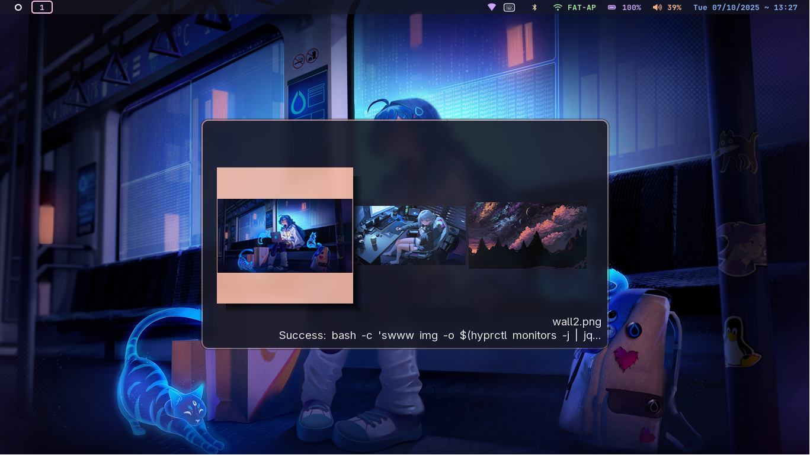
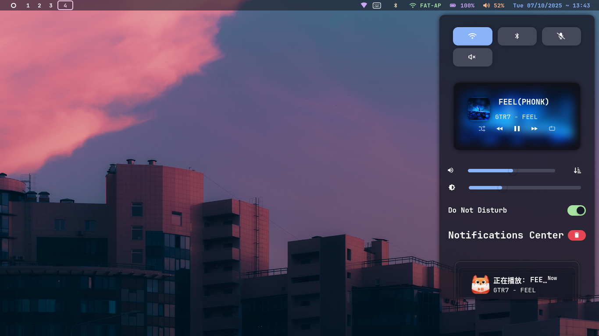
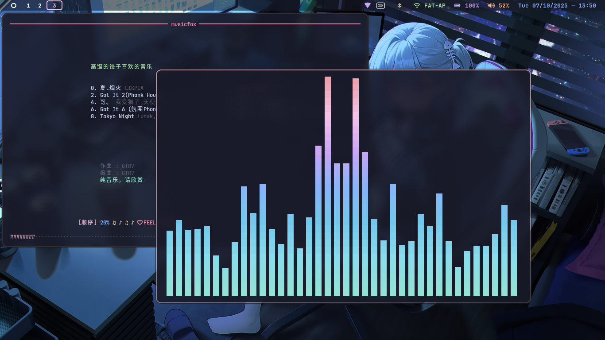
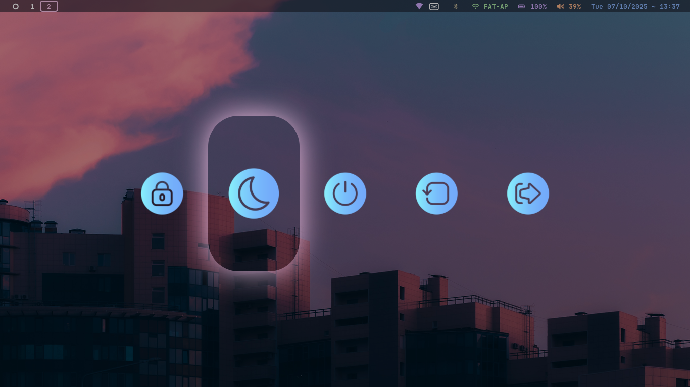

<h1 align="center">
  
  Hyprland Land
  
</h1>

   <a href="#-features">Features</a> • 
   <a href="#-gallery">Gallery</a> • 
   <a href="#-dependencies">Dependencies</a> • 
   <a href="#-ui--icon-themes">UI & Icons</a> • 
   <a href="#%EF%B8%8F-installation--setup">Installation</a> • 
   <a href="#%EF%B8%8F-keybinds">Keybinds</a> • 
   <a href="#-optional-gtk-theme-font--icon-setup">GTK Setup</a> 

## 🚀 Features 

- Gapless, borderless windows  
- Status bar hidden until overview  
- App drawer  
- Power menu  
- Volume flyout with mute indicator  
- Wallpaper selector  
- Status bar colored to wallpaper  
  
## 🖼 Gallery

| Background Selector                             |
| ----------------------------------------------- |
|  |

| Swaync                            |
| ------------------------------------- |
|  |

| Cava |
|---------|
|  |

| Power Menu |
|-----------|
|  |

## 📦 Dependencies

| Name          | Used For                                    | Link                                                           |
| ------------- | ------------------------------------------- | -------------------------------------------------------------- |
| `hyprland`    | Window manager                              | [hyprland](https://wiki.hypr.land/)                            |
| `swaync`      | Notifications, volume flyout                | [swaync](https://github.com/ErikReider/SwayNotificationCenter) |
| `waybar`      | Overview bar                                | [waybar](https://github.com/Alexays/Waybar)                    |
| `swww`        | Wallpaper daemon                            | [swww](https://github.com/Horus645/swww)                       |
| `bemenu`        | app drawer | [bemenu](https://github.com/bemenu/bemenu)                     |
| `swayimg` | Background selector    | [Swayimg](https://github.com/Swayimg/Swayimg)      |

## 🎨 UI & Icon Themes

| Name                       | Used For         | Link                                                                                                 |
| -------------------------- | ---------------- | ---------------------------------------------------------------------------------------------------- |
| `Yuurei-Angel`            | Cursor theme     | [Bibata Cursor](https://github.com/bt-ASH/p/2303824/)                                                    |
| `JetBrains Mono Nerd Font` | UI font          | [JetBrainsMono-NF](https://github.com/ryanoasis/nerd-fonts)                                          |
| `Material Symbols Rounded` | Power menu font  | [Material Symbols Rounded](https://github.com/google/material-design-icons/tree/master/variablefont) |
| `Catppuccin-Mocha-Icons`   | App drawer icons | [Catppuccin-Icons](https://github.com/Fausto-Korpsvart/Catppuccin-GTK-Theme)                         |
| `Catppuccin-Mocha-Themes`  | Themes           | [Catppuccin-Themes](https://github.com/Fausto-Korpsvart/Catppuccin-GTK-Theme)                        |

## 🛠️ Installation & Setup

> [!WARNING]  
> Tested only at `1080p` with `scale=1`. Other configurations may require adjusting **Rofi font size or padding** in `~/.config/rofi/themes/*`.

1. **Install dependencies** for your distribution.
2. **Configs**: Copy `.config` files to `~/.config`.
3. **Scripts**: Copy scripts from `bin` to `~/.local/bin`.
4. **Wallpapers**: Copy images from `wallpapers/` into `~/Pictures/Wallpapers`.

## ⌨️ Keybinds

| Action              | Shortcut          |
| ------------------- | ----------------- |
| Background selector | `Mod + Shift + D` |
| App drawer          | `Mod + D`         |
| Terminal (kitty)    | `Mod + Q`         |

